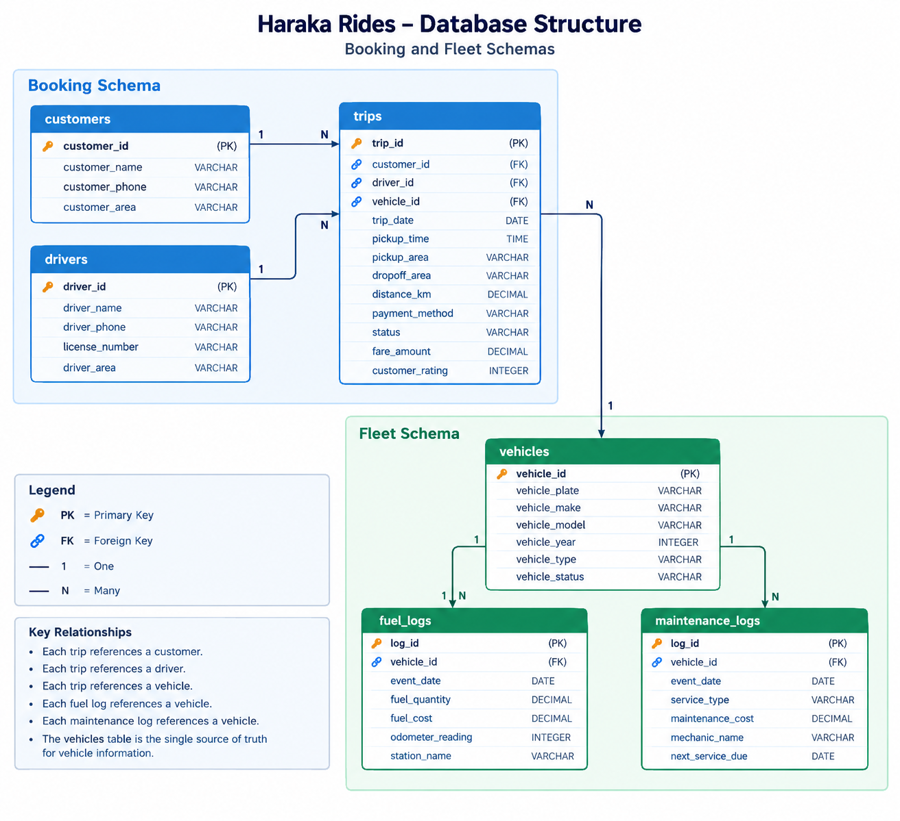

# Haraka Rides - Ride-Hailing Data Analytics Project 

A PostgreSQL data analytics project focused on data cleaning, database design, SQL analysis, and vehicle profitability for a ride-hailing company.

## Project Overview

Haraka Rides is a ride-hailing company with data coming from two separate operational systems: a booking system and a fleet system.

The booking data contains information about customers, drivers, vehicles, trips, payment amounts, and ratings, while the fleet data contains vehicle, fuel, and maintenance information.

The purpose of this project was to transform raw, inconsistent data into a clean, structured PostgreSQL database and use SQL to analyse trip performance, fleet operating costs, revenue, and vehicle profitability.

The fuel analysis connects booking and fleet data to answer the key business question for this project.

> Which vehicles are actually making the company money?

## Project Objectives

The main objectives of this project were to:

- Load the raw booking and fleet data into PostgreSQL staging tables.
- Profile the raw data and identify data-quality issues.
- Clean and standardize inconsistent values.
- Design a normalized relational database using booking and fleet schemas.
- Create relationships between customers, drivers, trips, vehicles, fuel logs, and maintenance   logs.
- Use SQL JOINS, aggregations, CTEs, Subqueries, and window functions to answer business questions.
- Analyse revenue, fuel costs, maintenance costs, and vehicle profitability.
- Provide data-driven findings that can support fleet management decisions.

## Dataset

The project uses two raw CSV datasets representing two separate operational systems within Haraka Rides.

### 1. Trips Dataset - 'trips_staging.csv'

- Rows: 406
- Columns: 18
- Purpose: Contains booking and trip-level information.

Key fields include:

- Trip ID
- Customer name and phone
- Customer area
- Driver name and phone
- Vehicle plate, make, and model
- Pickup and drop-off areas
- Trip date and pickup time
- Distance travelled
- Payment method
- Trip status
- Fare amount
- Customer rating

### 2. Fleet Dataset - 'fleet_staging.csv'

- Rows: 106
- Columns: 17
- Purpose: Contains vehicle fuel and maintenance events.

Key fields include:

- Log ID
- Vehicle plate, make, model, and year
- Vehicle type and status
- Event type
- Event date
- Fuel quantity and cost
- Odometer reading
- Station name
- Service type
- Maintenance cost
- Mechanic name
- Next service due

### Data Relationship

The two datasets contain vehicle information independently.

The 'vehicle plate' field was used as the natural reconciliation key between the raw datasets.

Because vehicle plate values contained inconsistent formatting, casing, and whitespace, they were normalized before matching vehicles across the two datasets.

## Data Quality Issues Identified

Before creating the clean database, the raw datasets were profiled to identify data quality problems.

The main issues identified include:

| Issues | Examples |
|---|---|
| Inconsistent casing | Names, status, payment method, vehicle makes/models |
| Whitespace | Names, vehicle plate, station names |
| Phone formats | Different phone number formats and missing values |
| Date formats | Multiple date formats in the same column |
| Currency values | Currency symbols and comma-formatted numbers |
| Invalid values | Rating outside the 1-5 range and negative distances |
| Missing values | Blank values across different fields |
| Duplicate records | Exact duplicate rows |
| Vehicle identifiers | Different formatting/spelling of the same plate |

The data was cleaned and standardized before being loaded into the final analytical tables.

## Database Design

The cleaned data was organized into two PostgreSQL schemas:

### Booking Schema

The 'booking' schema contains information related to customers, drivers, and trips.

| Table | Purpose |
|---|---|
| 'booking.customers' | Stores unique customer information |
| 'booking.drivers' | Stores unique driver inormation |
| 'booking.trips' | Stores individual trip transaction |

### Fleet Schema

The 'fleet' schema contains vehicle and fleet operating information.

| Table | Purpose |
|---|---|
| 'fleet.vehicles' | Canonical vehicle master table |
| 'fleet.fuel_logs' | Records vehicle fuel events and costs |
| 'fleet.maintenance_logs' | Records vehicle maintenance events and costs |

### Entity Relationships

The database uses primary and foreign keys to connect the entities.
- Each trip references a customer.
- Each trip references a driver.
- Each trip references a vehicle.
- Each fuel log references a vehicle.
- Each maintenance log references a vehicle.
- The 'fleet.vehicles' table acts as the single source of the truth for vehicle information.

Vehicle details were not duplicated across the clean tables. Instead, the 'vehicle_id' generated in 'fleet.vehicles' was used as the relationship key.

## Database Structure

The database consists of two PostgreSQL schemas: 'booking' and 'fleet'.

The 'booking' schema manages customers, drivers, and trips, while the 'fleet' schema manages vehicles, fuel logs and maintenance logs.

The 'fleet.vehicles' table serves as the canonical vehicle table, with trips, fuel logs, and maintenance logs referencing it through 'vehicle_id'.

## Data Cleaning & Transformation

The raw datasets were first loaded into staging tables as TEXT, ensuring the original data could be preserved without immediate type conversion.

The following cleaning and transformation steps were applied before loading the data into the final analytical tables.

### 1. Vehicle Plate Normalization

Vehicle plate numbers were standardized by:

- Removing leading and trailing whitespace
- Removing non-alphanumeric characters
- Converting values to uppercase

This allowed the same vehicle to be matched consistently across the booking and fleet datasets.

### 2. Name Standardization

Customer, driver, vehicle make, model, and other text fields were trimmed and standardized for consistent capitalization.

### 3. Phone Number Cleaning

Phone numbers were cleaned by removing unnecessary characters while preserving the value as text.

### 4. Date Conversion

Date fields containing different formats were identified and converted into PostgreSQL 'DATE' values using format - specific conversion logic.

### 5. Numeric and Currency Cleaning

Fields such as fare amount, fuel cost, and maintenance cost were stored as numeric values after removing currency symbols, commas, whitespace, and other non-numeric characters.

### 6. Rating Validation

Customer ratings were validated against the expected 1 - 5 range. Invalid or non-numeric ratings were converted to 'NULL' rather than being used as a valid rating.

### 7. Distance Validation

Distance values were converted to numeric values. Invalid and negative distances were treated as 'NULL' rather than being converted into positive values.

### 8. Customer and Driver Deduplication

Customers and drivers were extracted from repeated trip records and consolidated into separate tables.

Where the same person appeared multiple times with missing information in some records, available information was retained where appropriate.

### 9. Fleet Event Separation

The original fleet event date contained both fuel and maintenance records. These were separated into:

- 'fleet.fuel_logs'
- 'fleet.maintenance_logs'

based on the 'event_type' field.

### 10. Duplicate Handling

Exact duplicate records were removed during migration into the clean analytical tables while preserving the original staging data.

